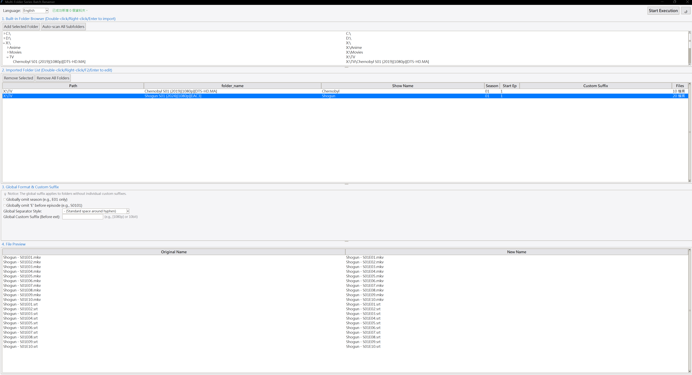

# Multi-Folder Series Batch Renamer

<p align="center">
  <a href="#english">English</a> | 
  <a href="#繁體中文">繁體中文</a> | 
  <a href="#简体中文">简体中文</a> | 
  <a href="#日本語">日本語</a> | 
  <a href="#한국어">한국어</a>
</p>

<p align="center">
  
</p>


---

<a name="english"></a>
## 🌐 English

A lightweight, high-performance GUI tool designed for media collectors to effortlessly batch-rename TV series, anime, and subtitles across multiple folders. Perfectly structured for seamless **Jellyfin**, **Emby**, and **Plex** metadata scraping.

### 🌟 Key Features
- **📂 Multi-Folder & Sub-scan**: Import multiple show folders simultaneously or auto-scan all sub-series under a root directory with one click.
- **🎬 Jellyfin/Plex Ready**: Standardizes naming formats (e.g., `Show Name - S01E01 - [1080p].mkv`) to ensure perfect compatibility with media server scrapers.
- **📝 Smart Subtitle Pairing**: Automatically detects video and subtitle files (`.srt`, `.ass`, etc.), matching them to the correct episode numbers.
- **🔍 Smart Show Name Deduction**: Intelligently extracts clean show titles by stripping out messy release tags, resolutions, and brackets.
- **⚡ Real-Time Preview & Inline Editing**: Instantly preview rename results and tweak individual file names, season numbers, or start episodes on the fly.
- **🛡️ Conflict Prevention**: Built-in duplicate detection and safety warnings to prevent file overwriting accidents.
- **🌍 Multi-Language GUI**: Supports Traditional Chinese, Simplified Chinese, English, Japanese, and Korean with Dark/Light mode support.

### 🚀 Quick Start (For Users)
1. Head over to the **[Releases](../../releases)** page.
2. Download the latest compiled `.exe` file (`SeriesRenamer.exe`).
3. Double-click to run and start organizing your media library instantly!

### 💻 Running from Source (For Developers)
```bash
git clone https://github.com/bob860712/Multi-Folder_Series_Batch_Renamer.git
cd Multi-Folder_Series_Batch_Renamer
python app.py
```

---

<a name="繁體中文"></a>
## 🌐 繁體中文

這是一個專為影音收藏家設計的輕量高效 GUI 工具，可輕鬆跨多個資料夾批次重命名影集、動漫與字幕，完美對應 **Jellyfin**、**Emby** 與 **Plex** 的刮削需求。

### 🌟 主要特色
- **📂 多資料夾與子目錄掃描**：同時匯入多個影集資料夾，或一鍵自動掃描根目錄下的所有子影集。
- **🎬 完美對應影音伺服器**：標準化命名格式（如 `Show Name - S01E01 - [1080p].mkv`），確保與媒體伺服器刮削器百分之百相容。
- **📝 智慧字幕配對**：自動偵測影片與字幕檔（`.srt`、`.ass` 等），並精準對應至正確的集數。
- **🔍 智慧影集名稱推斷**：自動過濾雜亂的發行標籤、解析度與括號，萃取乾淨的影集標題。
- **⚡ 即時預覽與行內編輯**：即時預覽重命名結果，隨時微調個別檔名、季數或起始集數。
- **🛡️ 衝突防範機制**：內建重複偵測與安全警告，防止檔案覆寫意外。
- **🌍 多國語言介面**：支援繁體中文、简体中文、英文、日本語與한국어，並支援深色/淺色模式。

### 🚀 快速開始（一般使用者）
1. 前往 **[Releases](../../releases)** 頁面。
2. 下載最新編譯好的 `.exe` 執行檔 (`SeriesRenamer.exe`)。
3. 雙擊即可執行，立即開始整理你的媒體庫！

### 💻 從原始碼執行（開發者）
```bash
git clone https://github.com/bob860712/Multi-Folder_Series_Batch_Renamer.git
cd Multi-Folder_Series_Batch_Renamer
python app.py
```

---

<a name="简体中文"></a>
## 🌐 简体中文

这是一款专为影音收藏家设计的高性能轻量化 GUI 工具，支持跨多个文件夹批量重命名电视剧、动漫及字幕，完美适配 **Jellyfin**、**Emby** 与 **Plex** 的媒体刮削规范。

### 🌟 主要特色
- **📂 多文件夹与子目录扫描**：同时导入多个剧集文件夹，或一键自动扫描根目录下的所有子剧集。
- **🎬 媒体服务器就绪**：规范化命名格式（如 `Show Name - S01E01 - [1080p].mkv`），确保与媒体服务器刮削器完美兼容。
- **📝 智能字幕配对**：自动检测视频与字幕文件（`.srt`、`.ass` 等），精准匹配至对应的集数。
- **🔍 智能剧集名称推断**：智能剥离杂乱的压制标签、分辨率与括号，提取干净的剧集标题。
- **⚡ 实时预览与即时编辑**：即时预览重命名结果，随心微调单个文件名、季数或起始集数。
- **🛡️ 冲突防护机制**：内置重复检测与安全提示，有效防止文件覆盖意外。
- **🌍 多语言界面**：支持繁體中文、简体中文、English、日本語与한국어，并支持深色/浅色模式切换。

### 🚀 快速开始（普通用户）
1. 前往 **[Releases](../../releases)** 页面。
2. 下载最新编译好的 `.exe` 文件 (`SeriesRenamer.exe`)。
3. 双击即可运行，立即开始整理您的媒体库！

### 💻 从源码运行（开发者）
```bash
git clone https://github.com/bob860712/Multi-Folder_Series_Batch_Renamer.git
cd Multi-Folder_Series_Batch_Renamer
python app.py
```

---

<a name="日本語"></a>
## 🌐 日本語

複数のフォルダに跨る海外ドラマ、アニメ、字幕ファイルをまとめて一括リネームできる、軽量かつ高性能なGUIツールです。**Jellyfin**、**Emby**、**Plex** のメタデータスクレイピングに完璧に対応しています。

### 🌟 主な機能
- **📂 複数フォルダ＆サブフォルダ一括スキャン**：複数のフォルダを同時に読み込むか、ルートディレクトリ下のすべてのサブシリーズをワンクリックで自動スキャンします。
- **🎬 メディアサーバー最適化**：ファイル名を標準化（例：`Show Name - S01E01 - [1080p].mkv`）し、メディアサーバーのスクレイパーとの互換性を確保します。
- **📝 スマート字幕ペアリング**：動画ファイルと字幕ファイル（`.srt`、`.ass`など）を自動検出し、正しい話数に自動でマッチングします。
- **🔍 スマートタイトル抽出**：ごちゃごちゃしたリリース情報タグ、解像度、カッコなどを自動で削ぎ落とし、クリーンな番組タイトルを抽出します。
- **⚡ リアルタイムプレビュー＆インライン編集**：リネーム結果をリアルタイムで確認しながら、個別のファイル名、シーズン番号、開始話数をその場で微調整できます。
- **🛡️ 競合防止機能**：重複検出と警告機能により、ファイルの上書き事故を未然に防ぎます。
- **🌍 多言語GUI対応**：繁體中文、简体中文、English、日本語、한국어に対応し、ダーク/ライトモードもサポートしています。

### 🚀 クイックスタート（一般ユーザー向け）
1. **[Releases](../../releases)** ページに移動します。
2. コンパイル済みの最新 `.exe` ファイル (`SeriesRenamer.exe`) をダウンロードします。
3. ダブルクリックして実行するだけで、すぐにメディアライブラリの整理を始められます！

### 💻 開発者向け（ソースコードからの実行）
```bash
git clone https://github.com/bob860712/Multi-Folder_Series_Batch_Renamer.git
cd Multi-Folder_Series_Batch_Renamer
python app.py
```

---

<a name="한국어"></a>
## 🌐 한국어

여러 폴더에 분산된 TV 시리즈, 애니메이션, 자막을 손쉽게 일괄 이름 변경할 수 있는 가볍고 고성능인 GUI 도구입니다. **Jellyfin**, **Emby**, **Plex** 메타데이터 스크래핑에 최적화되어 있습니다.

### 🌟 주요 기능
- **📂 다중 폴더 및 하위 스캔**：여러 쇼 폴더를 동시에 가져오거나 루트 디렉토리 아래의 모든 하위 시리즈를 원클릭으로 자동 스캔합니다.
- **🎬 미디어 서버 최적화**：파일명 형식을 표준화하여(`Show Name - S01E01 - [1080p].mkv` 등) 미디어 서버 스크래퍼와 완벽한 호환성을 보장합니다.
- **📝 스마트 자막 페어링**：비디오 및 자막 파일(`.srt`, `.ass` 등)을 자동으로 감지하여 올바른 에피소드 번호와 정확히 매칭합니다.
- **🔍 스마트 타이틀 추출**：복잡한 릴리즈 태그, 해상도, 괄호 등을 지능적으로 제거하여 깔끔한 쇼 타이틀을 추출합니다.
- **⚡ 실시간 미리보기 및 인라인 편집**：이름 변경 결과를 즉시 미리 보고 개별 파일명, 시즌 번호 또는 시작 에피소드를 즉석에서 수정할 수 있습니다.
- **🛡️ 충돌 방지 시스템**：중복 감지 및 경고 기능이 내장되어 있어 파일 덮어쓰기 사고를 방지합니다.
- **🌍 다국어 GUI 지원**：繁體中文, 简体中文, English, 日本語, 한국어 및 다크/라이트 모드를 지원합니다.

### 🚀 빠른 시작 (사용자용)
1. **[Releases](../../releases)** 페이지로 이동합니다.
2. 최신 컴파일된 `.exe` 파일(`SeriesRenamer.exe`)을 다운로드합니다.
3. 더블 클릭하여 실행하고 미디어 라이브러리를 즉시 정리하세요!

### 💻 소스코드에서 실행 (개발자용)
```bash
git clone https://github.com/bob860712/Multi-Folder_Series_Batch_Renamer.git
cd Multi-Folder_Series_Batch_Renamer
python app.py
```

---
## 📄 License
This project is licensed under the [MIT License](LICENSE).